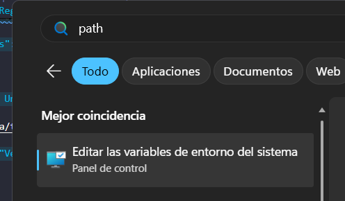
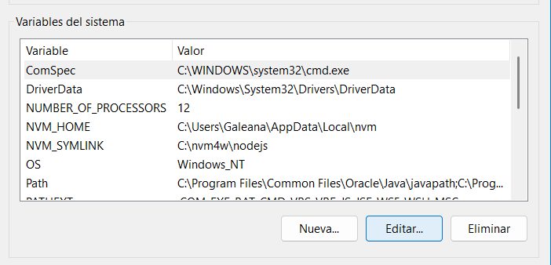
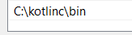

# Kotlin To-Do CLI

Aplicación de consola desarrollada en Kotlin para gestionar tareas desde terminal.

## Funcionalidades

- Agregar tareas
- Listar tareas
- Marcar tareas como completadas
- Eliminar tareas
- Persistencia de datos mediante archivos `.txt` y `.json`

Proyecto académico orientado al uso de:

- Kotlin
- Programación Orientada a Objetos
- Persistencia de datos
- Git Flow
- Trabajo colaborativo con ramas

---

# Características

✅ CRUD completo de tareas  
✅ Persistencia local de datos  
✅ Arquitectura por capas  
✅ Interfaz CLI simple  
✅ Uso de ramas Git  
✅ Commits descriptivos  
✅ Proyecto desarrollado en Kotlin

---

# Estructura del proyecto

```txt
src/
│
├── data/
│   └── tareas.txt
│
├── models/
│   └── Tarea.kt
│
├── services/
│   ├── ArchivoService.kt
│   └── TareaService.kt
│
├── utils/
│   └── Menu.kt
│
└── main.kt
```

---

# Reglas del proyecto

- Trabajar únicamente en ramas
- No hacer push directo a `main`
- Realizar commits descriptivos
- Mantener código limpio y ordenado
- Probar antes de subir cambios
- Hacer Pull Request antes del merge

---

# Requisitos

## 1. Java JDK

### Descargar

```txt
https://www.oracle.com/java/technologies/downloads/
```

### Verificar instalación

```bash
java -version
javac -version
```

---

## 2. Kotlin Compiler

### Descargar

```txt
https://github.com/JetBrains/kotlin/releases
```

---

# Instalación de Kotlin en Windows

1. Descargar el archivo `.zip` del compilador Kotlin.
2. Llevar el archivo descargado al disco local `C:\`
3. Descomprimir el archivo.
4. La carpeta debe quedar similar a:

```txt
C:\kotlin
```

---

# Configurar Kotlin en el PATH

1. Abrir el buscador de Windows.
2. Buscar:

```txt
Editar las variables de entorno del sistema
```

## Captura de búsqueda

```md

```

---

3. Se abrirá la ventana **Propiedades del sistema**
4. Dar clic en:

```txt
Variables de entorno
```

## Captura de variables

```md

```

---

5. En **Variables del sistema** buscar:

```txt
PATH
```

6. Dar doble clic y seleccionar:

```txt
Nuevo
```

7. Agregar:

```txt
C:\kotlin\bin
```

8. Guardar cambios.

## Captura de PATH

```md

```

---

# Verificar instalación de Kotlin

```bash
kotlinc -version
```

---

# Clonar el repositorio

```bash
git clone https://github.com/ManuGale/kotlin-todo-cli.git
```

Entrar a la carpeta:

```bash
cd kotlin-todo-cli
```

Abrir en VSCode:

```bash
code .
```

---

# Compilar proyecto

```bash
kotlinc src -include-runtime -d todo.jar
```

---

# Ejecutar proyecto

```bash
java -jar todo.jar
```

---

# Flujo Git utilizado

Cada integrante trabaja en una rama independiente:

| Integrante | Rama                          |
| ---------- | ----------------------------- |
| BUENDIA    | feature-crud-tareas           |
| EMILIO     | feature-documentacion-testing |
| GABO       | feature-modelo-tarea          |
| RAY        | feature-persistencia          |

---

# Autor

Proyecto realizado con fines académicos.
