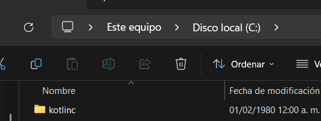

# Kotlin To-Do CLI

To-Do CLI - Gestor de tareas por consola. Permite agregar, listar, marcar como completada y eliminar tareas. Rápido, simple y sin dependencias externas. Ideal para usar desde la terminal. Datos persistentes en JSON. Escrito en Kotlin.

# Reglas del proyecto

- Trabajar en ramas
- No hacer push directo a main
- Hacer commits descriptivos
- Mantener código limpio
- Probar antes de subir cambios

# Requisitos

## 1. Java JDK

Descargar:

https://www.oracle.com/java/technologies/downloads/

Verificar instalación:

```bash
java -version
javac -version
```

---

## 2. Kotlin Compiler

Descargar:

https://github.com/JetBrains/kotlin/releases

Al descargar este zip que esta en un repositorio llevalo a la carpeta C y descomprimelo y te debe quedar en la carpeta C de tu disco local


Agregar Kotlin al PATH del sistema.

Para ingresar debes buscar en el bucador de Windows, ya sea escribiendo
_path_ o _editar variables de entorno de sistema_


Se abrira una ventana que es _Propiedades del sistema_ cuando ingreses
Haz click en Variables de entorno  


En el apartado Variables del sistema buscar _PATH_ y darle doble clik
y en el boton agregar agrega C:\kotlin\bin
y guardar


Verificar:

```bash
kotlinc -version
```

---

# Clonar el repositorio

```bash
git clone https://github.com/ManuGale/kotlin-todo-cli.git
```

Entrar a la carpeta:

```bash
cd kotlin-todo-cli
```

Abrir en VSCode:

```bash
code .
```

---

# Compilar proyecto

kotlinc src -include-runtime -d todo.jar

---
